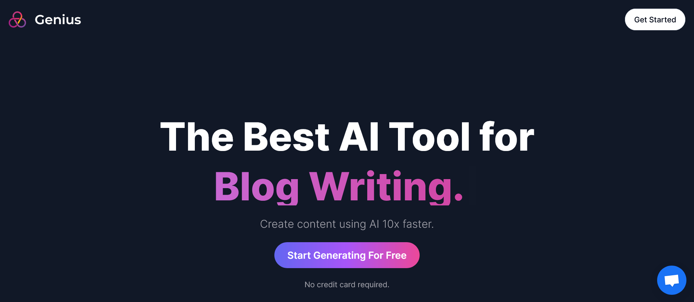
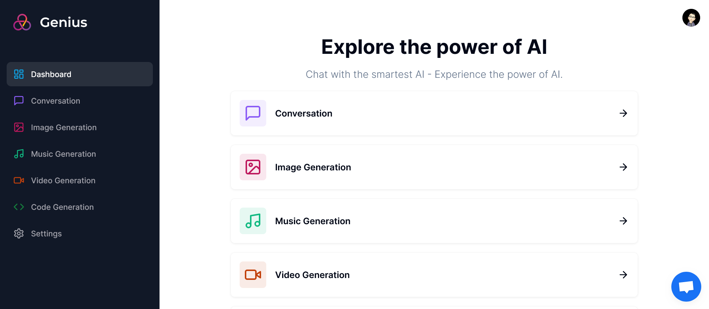
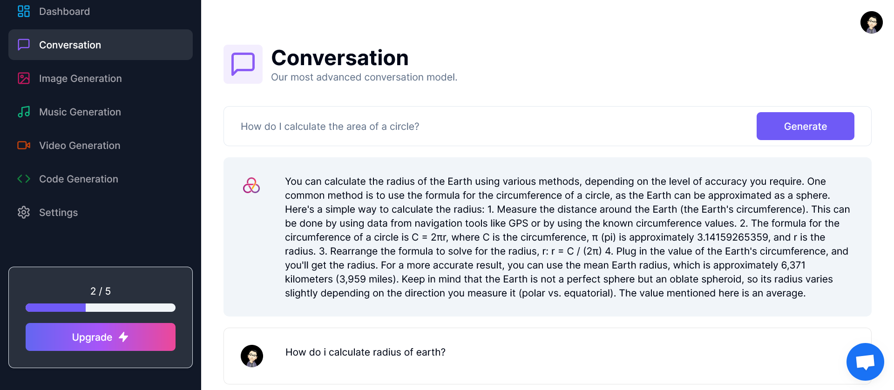
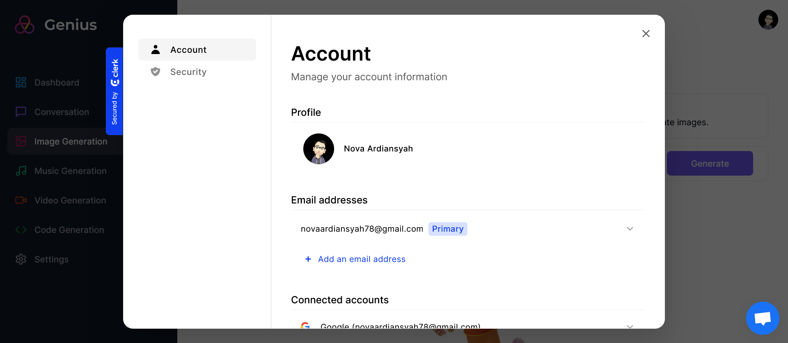
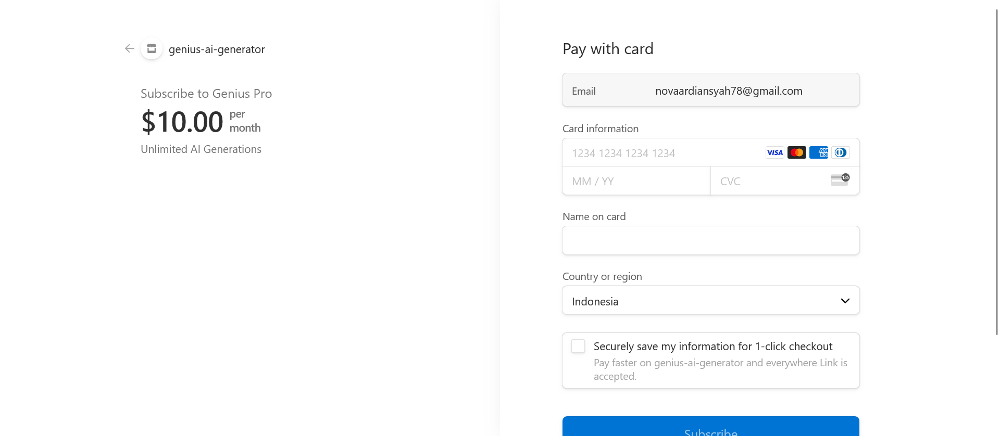

# Genius AI Generator

Hi Future Developer!

Welcome to my latest project! This time, I have created a modern web application using cutting-edge technology, Next.js 13. This application places a strong emphasis on harnessing the power of AI as the technology of the future. It's designed to assist humans in various tasks such as generating images, videos, code, answering a wide range of questions, and much more. All of these capabilities are seamlessly integrated into a single application called Genius AI Generator.

This project showcases the incredible potential of AI and how it can simplify and enhance various aspects of our lives. Feel free to explore, experiment, and experience the future with Genius AI Generator!

*Thank you for your interest. Happy coding!*

## ✨ Features:

- 🎨 Tailwind design
- 🚀 Tailwind animations and effects
- 📱 Full responsiveness
- 👤 Clerk Authentication (Email, Google, 9+ Social Logins)
- 📝 Client form validation and handling using react-hook-form
- 🚦 Server error handling using react-toast
- 🖼️ Image Generation Tool (Open AI)
- 🎬 Video Generation Tool (Replicate AI)
- 💬 Conversation Generation Tool (Open AI)
- 🎵 Music Generation Tool (Replicate AI)
- ⏳ Page loading state
- 💳 Stripe monthly subscription
- 🆓 Free tier with API limiting
- 📝 How to write POST, DELETE, and GET routes in route handlers (app/api)
- 📥 How to fetch data in server react components by directly accessing the database (WITHOUT API! like Magic!)
- ♻️ How to handle relations between Server and Child components!
- 🔄 How to reuse layouts
- 📁 Folder structure in Next 13 App Router

## Powering Up with an Electrifying Tech Stack! ⚡

This project is fueled by an electrifying lineup of cutting-edge technologies:
- [Next.js](https://nextjs.org/) - Unleash the power of modern web development.
- [Tailwind CSS](https://tailwindcss.com/) - Craft stylish and responsive interfaces effortlessly.
- [PrismaDB](https://www.prisma.io/) - Empowering efficient and robust database operations.
- [PlanetScale](https://www.planetscale.com/) - Scaling databases with ease.
- [Stripe](https://stripe.com/) - Secure and seamless online payment processing.
- [Clark Auth](https://clarkauth.com/) - Ensuring authentication security.
- [Crisp](https://crisp.chat/) - Elevating user engagement and support.

Prepare for an exhilarating ride through innovation and efficiency with this impressive tech stack!

## Licensing Groove🕺

Exciting news! This project is grooving to the rhythm of the [MIT License](https://github.com/novaardiansyah/genius-ai-generator/blob/main/LICENSE)! 🎉

## Let's Connect! 📞

Need to chat? Feel free to drop me a line via [Email](mailto:novaardiansyah78@gmail.com) or hit me up on [WhatsApp](https://wa.me/6289506668480?text=Hi%20Nova,%20I%20have%20a%20question%20about%20your%20project%20on%20GitHub:%20https://github.com/novaardiansyah/genius-ai-generator). I'm just a message away, ready to groove with you! 📩

## Sneak Peek 🌟

Get a glimpse of the app's enchanting world by exploring the current progress at [https://genius-ai-generator.vercel.app](https://genius-ai-generator.vercel.app). Feast your eyes on these snapshots that showcase the app's dynamic essence:

  
  

  
  

  

## Project Status 🚀 

